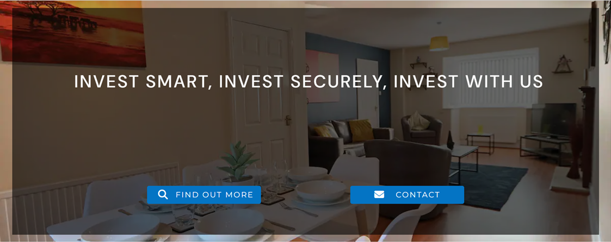
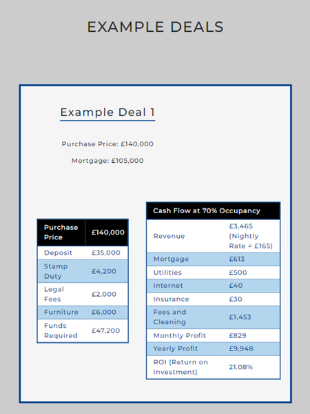

# Eternity Holdings Ltd. - README


#### By Dayna Townsend

[Access the live site here.](https://dayna199524.github.io/Eternity-Holdings-Ltd./)

This is the documentation for the website for Eternity Holdings Limited. The site has been built using HTML5, CSS3 and Bootstrap 5 for Milestone Project 1 for Code Institute's Web Development Diploma. This website was created for a real client, the implications of which are discussed later in the documentation.

***

## Contents

### [User Experience](#user-experience-ux)
- [Strategy](#strategy)
  - [User Stories](#user-stories)
    - [First Time Visitor Goals](#first-time-visitor-goals)
    - [Returning Visitor Goals](#returning-visitor-goals)
    - [Frequent User Goals](#frequent-user-goals)
- [Scope](#scope)
- [Structure](#structure)
- [Skeleton](#skeleton)
  - [Wireframes](#wireframes)
- [Surface \(Design)](#surface-design)
  - [Colour Scheme](#colour-scheme)
  - [Typography](#typography)
  - [Imagery](#imagery)
### [Features](#features-1)
- [Sitewide](#sitewide)
- [Homepage](#homepage)
- [Invest/Sell Page](#investsell-page)
- [Contact Page](#contact-page)
### [Technologies Used](#technologies-used-1)
- [Languages used](#languages-used)
- [Frameworks, Libraries and Programs Used](#frameworks-libraries--programs-used)
### [Testing](#testing-1)
- [Testing User Stories from User Experience \(UX) Section](#testing-user-stories-from-user-experience-ux-section)
  - [First Time Visitor Goals](#first-time-visitor-goals-1)
  - [Returning Visitor Goals](#returning-visitor-goals-1)
  - [Frequent User Goals](#frequent-user-goals-1)
- [Further Testing](#further-testing)
- [Known Bugs](#known-bugs)
### [Deployment](#deployment-1)
- [GitHub Pages](#github-pages)
- [Forking the GitHub Repository](#forking-the-github-repository)
- [Making a Local Clone](#making-a-local-clone)
### [Credits](#credits-1)
- [Code](#code)
- [Content](#content)
- [Media](#media)
- [Further Credits](#further-credits)
### [Acknowledgements](#acknowledgements-1)

***

## User Experience \(UX)

### Strategy

This project website was created for a real client who wanted a website created for the Investment Business he is setting up. The purpose of the website is to attract potential investors for HMO's and Serviced Accomodation and anyone looking to sell properties that would be suitable for these types of investment models.

#### User Stories

##### First Time Visitor Goals:

1. As a First Time Visitor, I want to easily understand the main purpose of the site and learn more about the company.
2. As a First Time Visitor, I want to be able to easily navigate throughout the site to find content.
3. As a First Time Visitor, I want to know how trustworthy the business is. I want to look for testimonials to understand what their previous customers thought of them and I want to see evidence of previous investments either on the site or through social media presence. I also want to see if the company is a part of any accredited unions/organisations.
4. As a First Time Visitor and potential investor/property seller, I want to easily find the company's contact details.
5. As a First Time Visitor and potential investor, I want to understand what type of investments Eternity Holdings Ltd. handles.
6. As a First Time Visitor looking to sell my property, I want to know what type of properties Eternity Holdings Ltd. is interested in buying.
7. As a First Time Visitor and investor, I want to know what profit I can make back from my investment.

##### Returning Visitor Goals:

1. As a Returning Visitor, I want to quickly get in touch with someone about investing/selling/obtaining more information.
2. As a Returning Visitor, I want to understand what a HMO or Serviced Accommodation Property is.
3. As a Returning Visitor, I want to see updated investment outcomes to see if the returns on investments have improved or diminished.
4. As a Returning Visitor, I want to find social media links to see what the company is currently working on.
5. As a Returning Visitor, I want to see what current investment opportunities are available.

##### Frequent User Goals:

1. As a Frequent User, I want to check to see if there are any newly added investment opportunities.
2. As a Frequent User, I want to check to see if there are any more examples of completed investments.
3. As a Frequent User, I want to see if there are any new reviews to check the continued trustworthiness of the company.
4. As a Frequent User, I'd like to sign up for a newsletter or be kept informed of investment opportunities.

### Scope

After assessing the needs of both new, returning and frequent users myself and the client decided upon the following 'must have' features to be included across the website:

- An easy pathway to the contact page with further button links to the page strategically placed around the site, such as in the hero image and footer, to encourage the user to get in touch.
- Relevant external links in the footer to social media pages and unions/organisations associated with the business.
- A hero image with a catchy slogan to draw the user in and inspire confidence and trust in the business
- Definitions for the two types of business models - HMO's and Serviced Accommodation - that the business specialises in.
- A review section
- Example investment outcomes
- A section that explains that the business not only is looking for investors but is also interested in buying suitable properties.
- A contact form
- Business operating hours
- Contact details

### Structure

After taking the scope into account and discussing with the client we decided upon the following three pages:

- Homepage
- Invest/Sell page
- Contact Page

Whilst the Homepage and Contact Page were easy choices for two of the three pages, we struggled to find the most appropriate name for the middle page.

The client wished to have an area where example deals and past projects/a portfolio could be displayed. I also felt it would be important due to the user stories to make sure it was obvious that the business also buys properties and isn't only looking for investors but the client wanted the hero slogan to be about investment. The user stories also suggested that there should be an explanation somewhere on the site as to what the two business models - HMO's and Serviced Accommodation - were to ensure that only appropriate inquiries in relation to the two desired business models were received. The difficulty that therefore arose was as to what title for this page would encompass all of these sections into one. 

Original name suggestions, including 'Example Deals', 'Portfolio' and 'Investments'. Eventually we decided on the simple "Invest/Sell" as the user can immediately see in the navbar that the company also wishes to buy propeties and that this page will contain information about both investing and selling.

Unfortunately, there is still an issue once smaller screen sizes come into play as the collapsed navbar prevent the user from immediately seeing there is an option to 'sell' and this is something to be discussed further with the client in the future to ensure all the needs of the business strategy are met.

### Skeleton

#### Wireframes

All wireframes can be found in a combined document located [here.](assets/Wireframes/All-Wireframes-2.0.pdf)

These wireframes represent the initial design ideas for the webpage.

### Surface \(Design)

#### Colour Scheme

- The colour scheme was decided by taking colours from the Eternity Holdings Logo shown below.   
  
  

- The client expressed interest in keeping the site really clean and sophisticated and so the colour scheme was kept simple and based on a monochromatic feel with blue touches from the logo. Please see below for the colour palette.


#### Typography

- The Montserrat font is the main font used throughout the whole website with Sans Serif as the fallback font in the event the main font cannot be loaded into the site. It produces a clean, sophisticated and professional look, especially when combined with increased letter spacing as I have done throughout the website. 

- DM Sans, with Sans Serif is additionally used for the hero image's slogan to created more impact for the user when landing on the homepage.

#### Imagery
  
- The hero image is a shot of one of the client's HMO properties which immediately displays the standard of work an investor can expect from the company.

- As the company is just starting out, I have currently used placeholder images for both the testimonial portraits and the property type cards on the Invest/Sell page. All images are free to use but the credits have still been included at the bottom of this documentation.

- I felt it important to use imagery of the company throughout the site and I have done this by adding a watermark of the logo behind the heading section of the Invest/Sell page and including the logo as an icon at the top of the contact form.

[Return to top ↑](#contents)

***

## Features

### Sitewide

<details>
    <summary>Desktop Navbar</summary>
    <br>
    
</details>

<details>
    <summary>Mobile/Small Screen Size Navbar</summary>
    <br>
    
</details>

<details>
    <summary>Footer</summary>
    <br>
    
</details>

<details>
    <summary>Mobile/Small Screen Size Footer</summary>
    <br>
    
</details>

### Homepage

<details>
    <summary>Hero Image</summary>
    <br>
    
</details>

<details>
    <summary>Three Reasons Why</summary>
    <br>
    
</details>

<details>
    <summary>Testimonials</summary>
    <br>
    
</details>

### Invest/Sell Page

<details>
    <summary>Overview Heading Section</summary>
    <br>
    
</details>

<details>
    <summary>Types of Accommodation</summary>
    <br>
    
</details>

<details>
    <summary>Example Deals</summary>
    <br>
    
</details>

### Contact Page

<details>
    <summary>Contact Form</summary>
    <br>
    
</details>

<details>
    <summary>Contact Details/Working Hours</summary>
    <br>
    
</details>

[Return to top ↑](#contents)

***

## Technologies Used

### Languages Used

- [HTML5](https://en.wikipedia.org/wiki/HTML5)
- [CSS3](https://en.wikipedia.org/wiki/Cascading_Style_Sheets)

### Frameworks, Libraries & Programs Used

1. [Bootstrap v5.0](https://getbootstrap.com/docs/5.0/getting-started/introduction/):
    - Bootstrap was used to assist with the responsiveness and styling of the website.
2. [Google Fonts](https://fonts.google.com/):
    - Google fonts was used to import the 'Montserraf' and 'DM Sans' fonts in varying weights into the style.css file which are used on all pages throughout the project.
3. [Font Awesome](https://fontawesome.com/):
    - Font Awesome was used on all pages throughout the website to add icons for aesthetic and UX purposes.
5. [jQuery](https://jquery.com/):
    - jQuery came with Bootstrap to make the navbar responsive but was also used for the smooth scroll function in JavaScript.
6. [Git](https://git-scm.com/):
    - Git was used for version control by utilizing the Codeanywhere terminal to commit to Git and Push to GitHub.
7. [GitHub](https://github.com/):
    - GitHub is used to store the projects code after being pushed from Git.
8. [Microsoft Word](https://microsoft.com/en-gb/microsoft-365):
    - Microsoft Word was used to resize images and create the watermark logo used on the Invest/Sell page.
9. [Balsamiq](https://balsamiq.com/):
    - Balsamiq was used to create the [wireframes](https://github.com/) during the design process.
10. Google DevTools:
    - Google DevTools was used to test responsiveness and to see live changes I made to both the HTML and CSS code. It also helped me with debugging/fixing any issues that occured. Accessed by right clicking on any element and selecting inspect.

[Return to top ↑](#contents)

***

## Testing

The W3C Markup Validator and W3C CSS Validator Services were used to validate every page of the project to ensure there were no syntax errors in the project. Additionally, I used a11y Colour Contrast Accessibility Validator to check the contrast between all of the font and background colours used across the website.

- [W3C Markup Validator](https://validator.w3.org/#validate_by_input)
    - Homepage - no errors found.
    - Invest/Sell page - no errors found.
    - Contact page - no errors found.
- [W3C CSS Validator](https://jigsaw.w3.org/css-validator/#validate_by_input) - no errors found.
- [a11y](https://color.a11y.com/) - no issues with colour contrast for accessibility.

### Testing User Stories from User Experience (UX) Section

#### First Time Visitor Goals

1. As a First Time Visitor, I want to easily understand the main purpose of the site and learn more about the company.
   - The user is greeted with the hero image which expresses the main goals of the company - that if the user wishes to "invest smart" and "invest securely" they should "invest with us", that is Eternity Holdings Ltd.
   - The hero image has a call to action button to "find out more" which will immediately take the user to the Invest/Sell page where they can find out more about the business.

2. As a First Time Visitor, I want to be able to easily navigate throughout the site to find content.
    - As soon as you enter the website, users are greeted with a clean and easily readable navigation bar with each of the three pages clearly labelled.
    - Within each page, the content is presented in a 100% width column of sections with clear sub-headings so the user can easily scroll down to find the information they wish to read.

3. As a First Time Visitor, I want to know how trustworthy the business is. I want to look for testimonials to understand what their previous customers thought of them and I want to see evidence of previous investments either on the site or through social media presence. I also want to see if the company is a part of any accredited unions/organisations.
   - We are relying on user familiarity wherby frequent practice is to place reviews/testimonials on the homepage. For those unused to this practice, the homepage contains few sections and it does not take long to scroll to the page and so these users would be likely to spot this section anyway.
   - Previous investments/example deals can be found in the clearly labelled Invest/Sell page. However, there is scope to add a portfolio or 'past projects' page or section on this page in the future.
   - Social media links and the organisation logo that Eternity Holdings is/will be a part of are displayed clearly in the footer and are active links that will take the user straight to the relevant pages. As of the moment, the company does not have a youtube account and so this link currently takes you to the Youtube homepage but the client wishes to link this to a specific account very soon in the future.

4. As a First Time Visitor and potential investor/property seller, I want to easily find the company's contact details.
    - The navbar has a clearly labelled link to the contact page.
    - Strategically placed call to action contact buttons are placed throughout the site: on the hero image, in the footer and at the bottom of the overview header section of the Invest/Sell page.

5. As a First Time Visitor and potential investor, I want to understand what type of investments Eternity Holdings Ltd. handles.
    - The Invest/Sell page has an overview paragraph that immediately explains the two types of investment properties Eternity Holdings Ltd. works with. Further imformation is immediately provided underneath this section providing definitions of each in case the user is unfamiliar or wants more information.

6. As a First Time Visitor looking to sell my property, I want to know what type of properties Eternity Holdings Ltd. is interested in buying.
    - Same as above.

7. As a First Time Visitor and investor, I want to know what profit I can make back from my investment.
    - The Invest/Sell page contains example deals at the bottom of the page. However, this could be better explained by adding to the overview paragraph at the top of the page to indicate its existance or by placing into a separate sub-page in the future.

#### Returning Visitor Goals

1. As a Returning Visitor, I want to quickly get in touch with someone about investing/selling/obtaining more information.
    - The navbar contains a clear link that will take you straight to the contact page. Whilst not seen on smaller screen sizes immediately, there are call to action contact buttons both in the hero image on the homepage and on the Invest/Sell overview header section that will take you to the contact page.

2. As a Returning Visitor, I want to understand what a HMO or Serviced Accommodation Property is.
    - There is clearly denoted section explaining these two types of properties on the Invest/Sell page

3. As a Returning Visitor, I want to see updated investment outcomes to see if the returns on investments have improved or diminished.
    - As the business is still new/in the early conception stages, this currently isn't possible and only example deals are displayed. This is an area that could be expanded upon in the future.
    - There are links to the company's social media pages in the footer with clear, familiar icons. However, as the business is still in its early days, they do not yet have much of a social media presence (and the youtube icon does not yet link to a specific account) and so this goal cannot be met through this method.

4. As a Returning Visitor, I want to find social media links to see what the company is currently working on.
    - Social media links that will take you straight to the business' social media pages are shown clearly in the footer as clickable links. However, as stated above, the business does not yet have much of a social media presence and so whilst the links are easy to find, the user will not obtain the information they want.

5. As a Returning Visitor, I want to see what current investment opportunities are available.
    - Whilst the website advertises that they are interested in investors getting in touch, there isn't yet an area where specific projects requiring investors can be listed. This is an area to add in the future.

#### Frequent User Goals:

1. As a Frequent User, I want to check to see if there are any newly added investment opportunities.
    - As above, whilst the website advertises that they are interested in investors getting in touch, there isn't yet an area where specific projects requiring investors can be listed and is an area to be added in the future.

2. As a Frequent User, I want to check to see if there are any more examples of completed investments.
    - Likewise with above, the business is just starting out and does not yet have any investments it can present on the webpage or social media which is why only example deals are included on the website. As the business doesn't yet have much of a social media presence, it also doesn't yet make sense to try and lead the user to the social media links for this information if it doesn't yet exist. However, these is are definitely things that can be added in the future.

3. As a Frequent User, I want to see if there are any new reviews to check the continued trustworthiness of the company.
    - Goal not yet met. However, as the business expands, the review section can be turned into a carousel with additional reviews added. This would also lend itself to the responsiveness of the page as it will reduce user scrolling on smaller screens.

5. As a Frequent User, I'd like to sign up for a newsletter or be kept informed of investment opportunities.
    - This isn't yet possible for me as a student developer as I have not yet learned the relevant material for providing a sign up link where updates can be automatically sent out to users who have signed up by the client.

### Further Testing

- The Website was tested on Google Chrome, Internet Explorer, Microsoft Edge and Safari browsers.
- The website was viewed on a variety of devices such as Desktop, Laptop, iPad Pro \(2020), iPhone 13 and iPhone 8.
- Testing was carried out to ensure that all pages were linking correctly.
- Friends and family members were asked to review the site and documentation to point out any bugs and/or user experience issues.

### Known Bugs

- When landscape on iPhone 13 there is white space either side of the page to prevent the webpage from going underneath the camera area where the screen wraps around it. This is potentially a formatting produced by iOS which I currently do not have the knowledge to overwrite but it could be worth exploring in the future. However, the formatting, despite this white space still looks good overall and there isn't any side scrolling needed.
- After replacing lorem text in the review containers in the Testimonials section of the homepage, despite there being a gx-0 class in all the rows on the homepage, a gutter still began appearing on the right-hand-side of the page. DevTools presented it as struck out and overwritten with the gx-0 class but the gutter still wouldn't disappear without writing a new css rule at the bottom of the style sheet of .row {--bs-gutter-x: 0;}. Whilst this fixed the problem, I am still unsure as to what caused it in the first place.

[Return to top ↑](#contents)

***

## Deployment

### GitHub Pages

The project was deployed to GitHub Pages using the following steps...

1. Log in to GitHub and locate the [GitHub Repository](https://github.com/)
2. At the top of the Repository (not top of page), locate the "Settings" Button on the menu.
    - Alternatively Click [Here](https://raw.githubusercontent.com/) for a GIF demonstrating the process starting from Step 2.
3. Scroll down the Settings page until you locate the "GitHub Pages" Section.
4. Under "Source", click the dropdown called "None" and select "Master Branch".
5. The page will automatically refresh.
6. Scroll back down through the page to locate the now published site [link](https://github.com) in the "GitHub Pages" section.

### Forking the GitHub Repository

By forking the GitHub Repository we make a copy of the original repository on our GitHub account to view and/or make changes without affecting the original repository by using the following steps...

1. Log in to GitHub and locate the [GitHub Repository](https://github.com/)
2. At the top of the Repository (not top of page) just above the "Settings" Button on the menu, locate the "Fork" Button.
3. You should now have a copy of the original repository in your GitHub account.

### Making a Local Clone

1. Log in to GitHub and locate the [GitHub Repository](https://github.com/)
2. Under the repository name, click "Clone or download".
3. To clone the repository using HTTPS, under "Clone with HTTPS", copy the link.
4. Open Git Bash
5. Change the current working directory to the location where you want the cloned directory to be made.
6. Type `git clone`, and then paste the URL you copied in Step 3.

```
git clone https://github.com/YOUR-USERNAME/YOUR-REPOSITORY
```

7. Press Enter. Your local clone will be created.

```
$ git clone https://github.com/YOUR-USERNAME/YOUR-REPOSITORY
> Cloning into `CI-Clone`...
> remote: Counting objects: 10, done.
> remote: Compressing objects: 100% (8/8), done.
> remove: Total 10 (delta 1), reused 10 (delta 1)
> Unpacking objects: 100% (10/10), done.
```

Click [Here](https://help.github.com/en/github/creating-cloning-and-archiving-repositories/cloning-a-repository#cloning-a-repository-to-github-desktop) to retrieve pictures for some of the buttons and more detailed explanations of the above process.

[Return to top ↑](#contents)

***

## Credits

### Code

- I based the layout of the hero overlay on the code found on [this page](https://mdbootstrap.com/docs/standard/extended/hero/).
- I used the Club Ethos Center Content code from the [Love Running project](https://github.com/Code-Institute-Solutions/Love-Running-Solutions/tree/master/04_creating_the_club_ethos/04_club_ethos_center_content_1) from the coursework preceding this project to help me style the testimonial images into circles.
- The basic sign-up form code was based upon the [Love Running Sign-Up Challenge](https://learn.codeinstitute.net/courses/course-v1:CodeInstitute+CSE101+2020_Q2/courseware/be0e510a3aca4bccb6e0bba4cf7cf06b/d533998456514d97a88ce691537e00a6/).

- [Bootstrap v5.0](https://getbootstrap.com/docs/5.0/getting-started/introduction/): Bootstrap Library used throughout the project for styling classes and responsiveness using the Bootstrap Grid System.

- In order to create the drop down menus in the Features section of this README I found the code [here](https://developer.mozilla.org/).

- This README file was based upon the Code Institue README template found [here](https://github.com/Code-Institute-Solutions/SampleREADME).

### Content

- All code content, except that which has already been mentioned above was written by the developer. 
- The client provided the website body content for the hero image slogan, Homepage: three reasons why section and the example deals section's tables data.
- Information about HMO's and Serviced Accomodation in the Types of Accomodation section of the Invest/Sell page were based on information found in the following three pages:
  - [Furniture Pack Solutions](https://www.furniturepack.co.uk/blog/why-hmos-are-a-great-investment/)
  - [Property Investments UK](https://www.propertyinvestmentsuk.co.uk/serviced-accommodation/)
  - [GOV.UK: Private Renting](https://www.gov.uk/private-renting/houses-in-multiple-occupation)

### Media

- Eternity Holdings logos, including the logo text and icon were provided by the client.
- Testimonials section images were sourced from [Pixabay](https://pixabay.com/).
- Types of Accommodation section images were sourced from [Unsplash](https://unsplash.com/).

### Further Credits

- Colour palette for website shown above in the Surface section was created using [coolors](https://coolors.co/).
- I used [IMAGECOLORPICKER.COM](https://imagecolorpicker.com/en#google_vignette) to find the hex codes for the blues in the the company's logo I wanted to use in the colour palette.

[Return to top ↑](#contents)

***

### Acknowledgements

- My Mentor for their helpful feedback and information provision.

- Iris Smok, our Cohort Facilitator for providing such informative stand-ups and helpful resources.

- My friends for helping me to test the responsiveness of the website across their devices.

[Return to top ↑](#contents)
